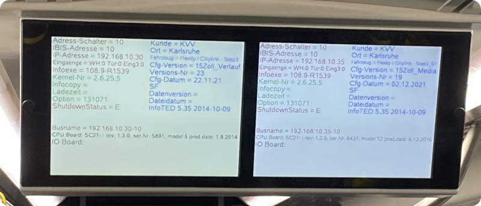
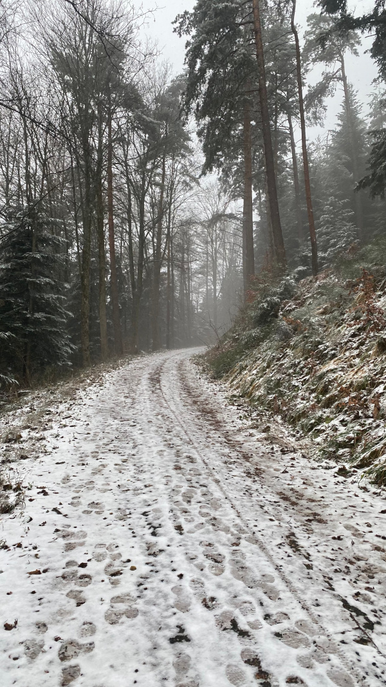
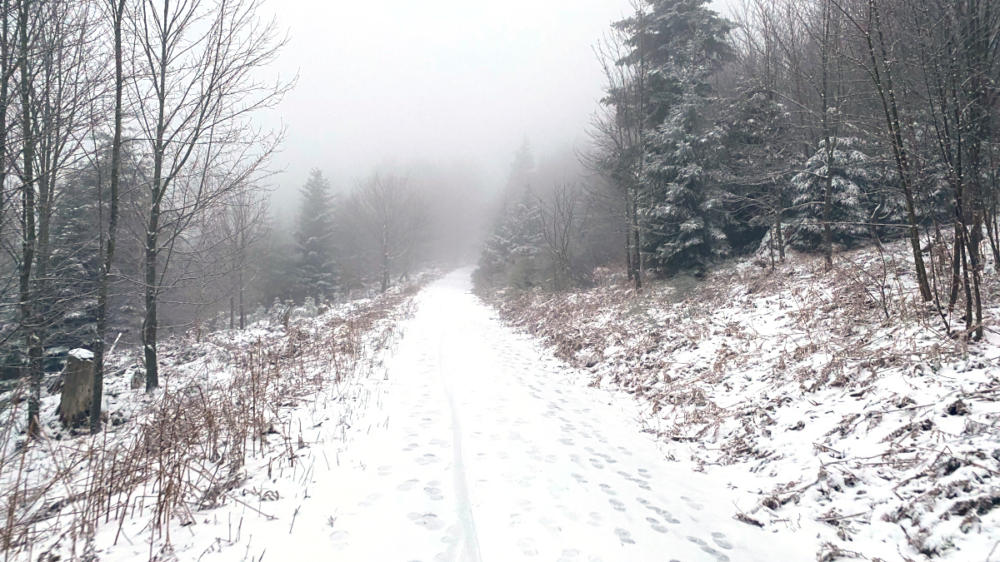
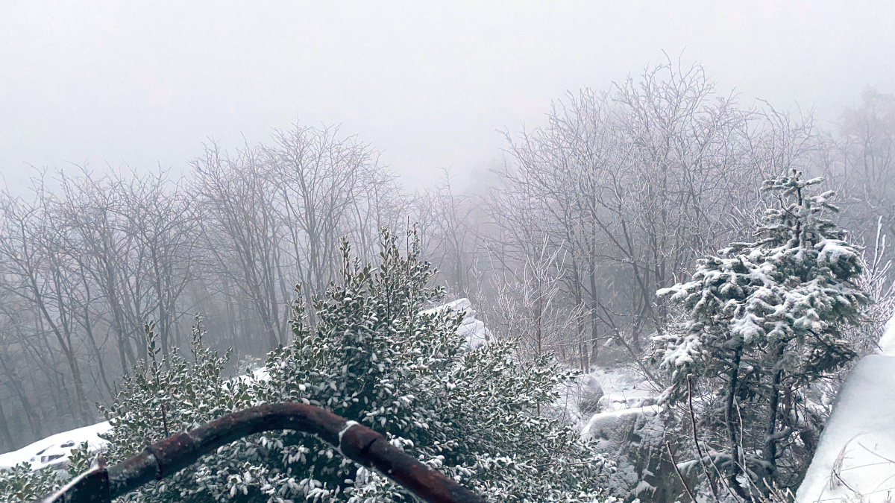

Der Dezember-Termin fiel auf einen Samstag. Um etwas besonderes zu unternehmen, haben wir uns zu einer Wanderung
verabredet. Die Tour startete in Bad-Herrenalb und ging hoch zum Bernstein.

Der Start war ein wenig holprig, weil der Bordrechner der Straßenbahn ein paar Kilometer vor Herrenalb ausgefallen ist.
Ein Teil der Gruppe musste 45 Minuten auf den Techniker warten, bis die Straßenbahn im Notfallmodus bis Herrenalb weiter
fahren konnte.

*Auch Straßenbahnen sind nur Computer*

Dafür gab es, oben in Herrenalb Schnee und, je höher wir kamen, umso mehr richtiges Winterwetter. Hier sind einige
Bilder von der Tour:

*Am Anfang noch Schneematsch…*

*… wurde es später richtig winterlich.*

*Am Bernstein*

*Eiskunst*

